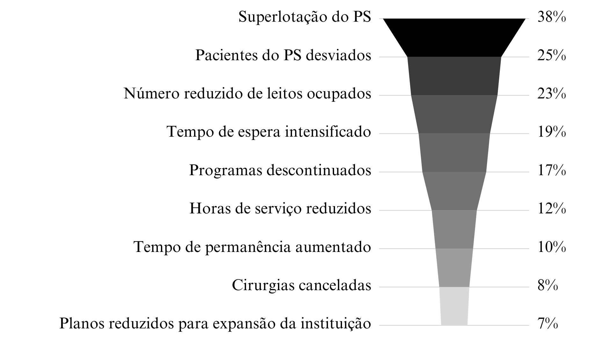

# DOCUMENTAÇÃO DE CONTEXTO 

Em março do ano de 2020, a Organização Mundial da Saúde declarou uma pandemia da Síndrome Respiratória Aguda-Grave causada pelo Coronavírus 19 (SARS-COV-2), em função dos níveis de disseminação e gravidade (OMS, 2022). No Brasil, o Conselho Nacional de Saúde emitiu recomendações para a promoção do isolamento social, conforme orientações da OMS e da Organização Pan-Americana da Saúde (Opas) (BRASIL, 2020):

>“Considerando que a taxa de 2,8 de contaminação pelo novo Corona vírus no Brasil, apontada como a maior entre 48 países analisados pelo Imperial College de Londres, impõe ao país um cenário epidemiológico com crescimento acelerado e exponencial de casos e óbitos”. (BRASIL,2020) 

O cenário previsto pelo Imperial College de Londres tornou-se uma realidade, e com ela, se escancararam diversos problemas estruturais da saúde do país. Além disso, observou-se a necessidade de disponibilizar novos leitos numa tentativa falha de não sobrecarregar o sistema de saúde. 

>"segundo o Ministério da Saúde (MS) 1 a cada 10 pacientes infectados necessitam de atendimento hospitalar e segundo a Federação Brasileira de Hospitais (FBH) o Brasil possui apenas 1,95 leitos/1000 habitantes, número este muito inferior comparado a média mundial que é de 3,2 leitos/1000 habitantes." (AIRES,2020) 

 Tendo como exemplo então a pandemia do COVID-19, o Brasil, assim como o restante do mundo, teve seus problemas estruturais na área da saúde, principalmente em decorrência da falta de leitos e a superlotação de hospitais e unidades de saúde, que impedia o tratamento eficaz dos pacientes, além de abrir brechas para questões de biossegurança, tanto dos pacientes quanto das equipes de saúde, já que se trata de uma doença transmitida pessoa a pessoa, através de partículas e aerossóis (VRISHALI, 2021). 

Em decorrência disso, o Ministério da Saúde passou a incentivar a utilização de hospitais de campanha para o tratamento e segregação de casos simples e moderados do COVID-19, numa tentativa de evitar um colapso do sistema de saúde. Estes são um tipo especial de hospital que é uma “unidade hospitalar emergencial temporária que tem como objetivo ofertar serviços de atenção à saúde, através de equipes multiprofissionais, em atendimentos de urgência e emergência" (AIRES, 2020).  

Acerca da utilização dessas unidades hospitalares, o Ministério da Saúde emitiu a Portaria 1514 de 15 de junho de 2020, que traz importantes considerações, sendo duas delas as contidas nos artigos 2 e 4:

> - “Art. 2º A implantação dos Hospitais de Campanha consiste em uma das estratégias, em caráter excepcional e temporário, que podem ser utilizadas para ampliação e organização da oferta de leitos e deverá fazer parte dos Planos de Contingência elaborados pelos governos Estaduais, do Distrito Federal e dos Municípios para o enfrentamento à COVID-19. 
> - Art. 4º As unidades hospitalares de campanha devem funcionar com o acesso regulado, voltadas para a internação de pacientes com sintomas respiratórios de baixa e média complexidade, podendo funcionar como retaguarda clínica para unidades hospitalares permanentes que possuam UTI e sejam definidas como referência para tratamento da COVID-19” (BRASIL, 2020) 

Entretanto, os hospitais de campanha não conseguiram suprir as necessidades por completo, e ocorreu uma superlotação e falta de leitos no geral. Posto isso, nota-se a importância de identificar de forma correta e otimizada os casos indicados a ir aos hospitais de campanha ou não. Dessa forma, o paciente não estaria exposto desnecessariamente ao ambiente hospitalar e a possíveis contaminações, bem como reduziria a superlotação dos ambientes de saúde, trazendo melhores condições de trabalho às equipes de saúde e de atendimento aos pacientes que necessitem de internações. 

## Problema
Conforme demostrado superlotação nas unidades de saúde e suas consequências negativas, tais como a demora no atendimento, sobrecarga dos profissionais de saúde e busca inadequada de atendimento em unidades não especializadas. Esses problemas são bastante comuns em muitos sistemas de saúde e podem afetar significativamente a qualidade do atendimento e a saúde dos pacientes. 

## Objetivos

O objetivo geral deste projeto e o desenvolvimento de uma aplicação web para reduzir o fluxo de pessoas nas filas de espera de hospitais e oferecer uma alternativa mais eficiente e segura para os pacientes que precisam de atendimento médico.

Como objetivos específicos, podemos ressaltar:
 
- Contribuir para a prevenção e controle de doenças transmissíveis, uma vez que ajuda a reduzir a aglomeração de pessoas em ambientes de saúde. 

- Reduzir o tempo de espera dos pacientes e melhorar a qualidade do atendimento prestado. 

- Oferecer aos usuários funcionalidades que permitem a interação com os agentes de saúde de forma fácil e segura, proporcionando maior conforto e eficiência tanto para os pacientes quanto para os profissionais de saúde. 

## Justificativa

Atualmente, o atendimento de urgência é centrado no hospital. Os serviços de emergência operam com um grande fluxo de demanda espontânea, o que acaba levando à superlotação e, como consequência, aumento da mortalidade de pacientes, atrasos no transporte, atrasos no tratamento, desvios de ambulâncias e maiores custos financeiros, como apresentado no Gráfico 1. Existem outras consequências indesejadas, como perda de recursos, uso indevido de tempo e insatisfação entre a equipe do pronto-socorro e os pacientes. (ERENLER et al., 2014). É necessário repensar o modelo de atendimento de urgência e buscar soluções alternativas para melhorar a eficiência e a qualidade do atendimento, reduzindo a superlotação nos serviços de emergência e melhorando a satisfação dos pacientes e profissionais da área da saúde. 

Gráfico 1 - Percentagem de hospitais que relatam algum impacto

Fonte: Adaptado de MedicinaNET (2013).
## Público-Alvo

Por se tratar de um problema que abrange toda a rede de saúde nacional, o público-alvo
desta solução é definido por todas as pessoas que utilizem a rede pública de saúde e agentes de
saúde, dessa maneira estejam vulneráveis aos riscos da superlotação, como a consequente
exposição às doenças transmissíveis e a baixa qualidade de atendimento.