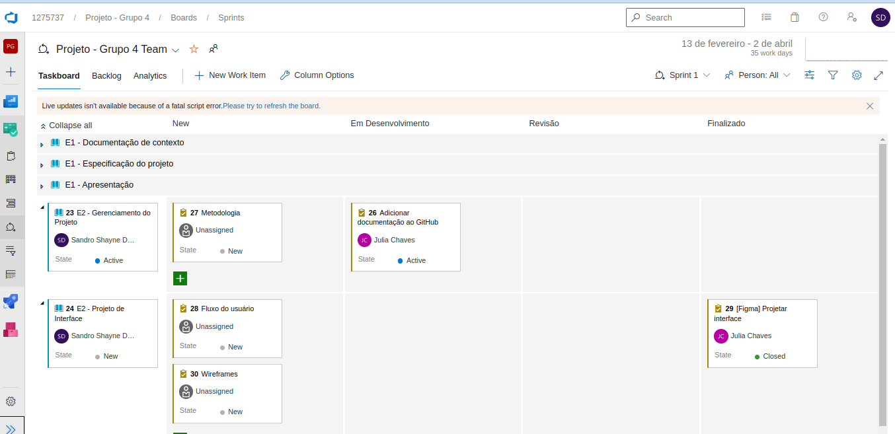

# METODOLOGIA

A metodologia utilizada em um projeto de desenvolvimento de software deve abranger diversas etapas do processo de desenvolvimento, desde a concepção do projeto até a entrega do produto final. Isso inclui a definição das ferramentas e técnicas utilizadas pela equipe para a manutenção dos códigos e demais artefatos do projeto, bem como para a organização do time na execução das tarefas.

## Relação de Ambientes de Trabalho 
Os artefatos do projeto são desenvolvidos a partir de diversas plataformas e a relação dos ambientes com seu respectivo propósito é apresentada na tabela que se segue.  
| Ambiente  | Plataforma | Link de Acesso |
|--- |--- |--- |
|pmv-ads-2023-1-e1-proj-web-t11-pmv-ads-2023-1-e1-proj-web-t11-t4-Vital-Sus| Github | https://github.com/ICEI-PUC-Minas-PMV-ADS/pmv-ads-2023-1-e1-proj-web-t11-pmv-ads-2023-1-e1-proj-web-t11-t4-Vital-Sus |
|Documentos do Projeto | Microsoft Teams |https://sgapucminasbr.sharepoint.com/:f:/s/team_sga_2418_2023_1_4577111-Grupo4/Es205Qeh1bhIoI6hbq417u4B6adGPJ708gEwaOa3j125Qg?e=iATUMo |
|Projeto de Interface e Wireframes| Figma | https://www.figma.com/file/vE2KvFA0mCxs11UAlVf3FD/Projeto---Vital-SUS?node-id=0%3A1&t=b5JYcYg9vw5bzpEe-1 |
|Gerenciamento de Projetos | Azure Devops | https://dev.azure.com/VitalSUS/Projeto%20-%20Grupo%204/_sprints/taskboard/Projeto%20-%20Grupo%204%20Team/Projeto%20-%20Grupo%204/Sprint%201 |

## Gerenciamento de Projeto

No processo de desenvolvimento de software, a escolha da metodologia adequada é fundamental para garantir a eficiência e qualidade do projeto. Uma das abordagens mais utilizadas atualmente é a adoção de metodologias ágeis, que têm como princípio a entrega contínua de valor ao cliente.

No caso específico do projeto em questão, a equipe de desenvolvimento optou por adotar o Scrum como metodologia ágil. O Scrum é uma das metodologias mais populares e amplamente utilizadas no desenvolvimento de software, devido à sua abordagem iterativa e colaborativa.

O Scrum consiste em uma série de reuniões e cerimônias, como o Sprint Planning, Daily Scrum, Sprint Review e Sprint Retrospective, que são realizadas em ciclos curtos de tempo, chamados de sprints. Durante cada sprint, a equipe trabalha em um conjunto de funcionalidades previamente definidas e se reúne diariamente para compartilhar o progresso e planejar as atividades do dia.

Além disso, o Scrum enfatiza a importância da transparência, comunicação e colaboração entre os membros da equipe, o que permite que todos trabalhem de forma integrada e alinhada com os objetivos do projeto. Também é comum a utilização de ferramentas de gestão de projetos, como o Trello ou Jira, para auxiliar na organização e acompanhamento das tarefas.

Portanto, a escolha da metodologia ágil Scrum para o projeto de desenvolvimento de software em questão demonstra o comprometimento da equipe em garantir a entrega contínua de valor ao cliente e o uso de boas práticas de gestão de projetos para garantir a eficiência e qualidade do processo de desenvolvimento.

### Divisão de Papéis

**A equipe está organizada da seguinte maneira:** 

- **Product Owner:** Júlia Chaves Dutra

- **Scrum Master:** Sandro Shayne Dutra

- **Equipe de Desenvolvimento:**

    - Dimitri Oliveira Novaes 

    - Pedro Celso Mendes 

    - Thiago Singulano Machado 

### Processo

A organização e distribuição eficiente das tarefas de um projeto é fundamental para garantir a produtividade da equipe e a conclusão bem-sucedida do projeto dentro do prazo e orçamento previstos. Para isso, a utilização de ferramentas de gerenciamento de projetos se torna imprescindível.

No caso em questão, a equipe de desenvolvimento do projeto está utilizando o Azure DevOps para organizar e distribuir as tarefas do projeto estruturado com as seguintes listas:  

- **New:** Ele é responsável por receber as tarefas a serem trabalhadas e representa o Product Backlog do projeto. É importante que todas as atividades identificadas no decorrer do projeto também sejam incorporadas a essa lista, para que o backlog possa ser constantemente atualizado e refinado.

- **Em desenvolvimento:** Representa o status atual das tarefas em execução. Quando uma tarefa é movida para essa coluna, significa que ela está em andamento e que a equipe de desenvolvimento está trabalhando nela. 

- **Revisão:** Representa a avaliacao de código para identificar possíveis erros, vulnerabilidades e oportunidades para melhoria dos códigos.

- **Finalizado:** Composta por tarefas que passaram por todos os testes e controles de qualidade e estão prontas para serem entregues ao usuário. Nessa lista, as tarefas são consideradas oficialmente concluídas e prontas para serem integradas ao produto final. 

O quadro Scrum é uma ferramenta importante para a gestão e organização das atividades em projetos desenvolvidos utilizando metodologias ágeis. No caso específico do grupo em questão, o quadro Scrum foi criado na ferramenta de gerenciamento de projetos Azure DevOps.

O Azure DevOps é uma plataforma completa de DevOps que permite o gerenciamento de projetos de software, desde o planejamento até a entrega final ao usuário. O quadro Scrum do grupo foi criado dentro dessa plataforma, o que permite que a equipe de desenvolvimento tenha acesso a todas as funcionalidades da ferramenta.

Por meio do quadro Scrum, a equipe pode acompanhar as tarefas, estabelecer prioridades, identificar possíveis gargalos e alocar recursos de forma mais eficiente. Em resumo, o quadro Scrum do grupo está disponível na plataforma Azure DevOps, como apresentado na Figura 1, o que permite que a equipe de desenvolvimento tenha acesso a uma série de recursos que auxiliam na gestão do projeto e na entrega de um produto de qualidade.

Figura 1 - Quadro Scrum criado no Azure Devops.

Fonte: Dos autores (2023).
