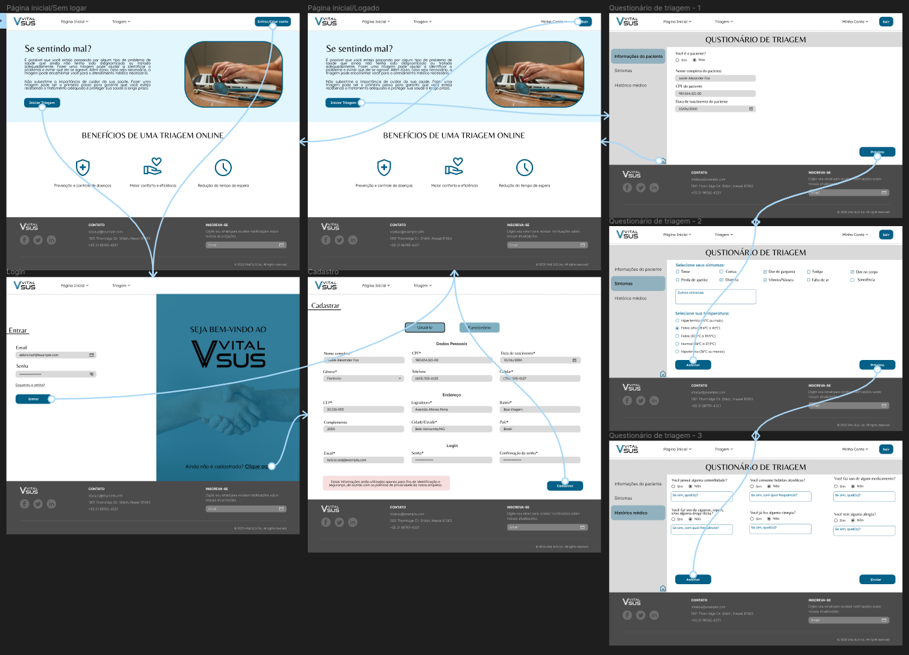
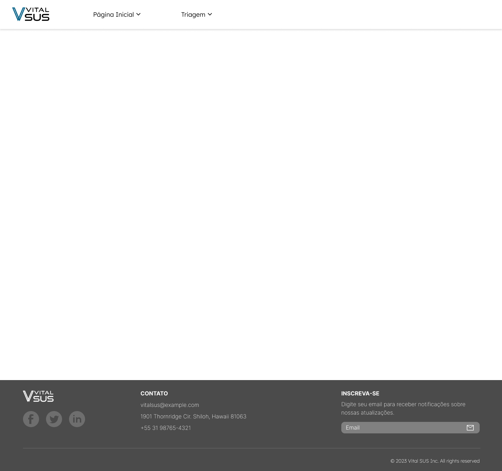
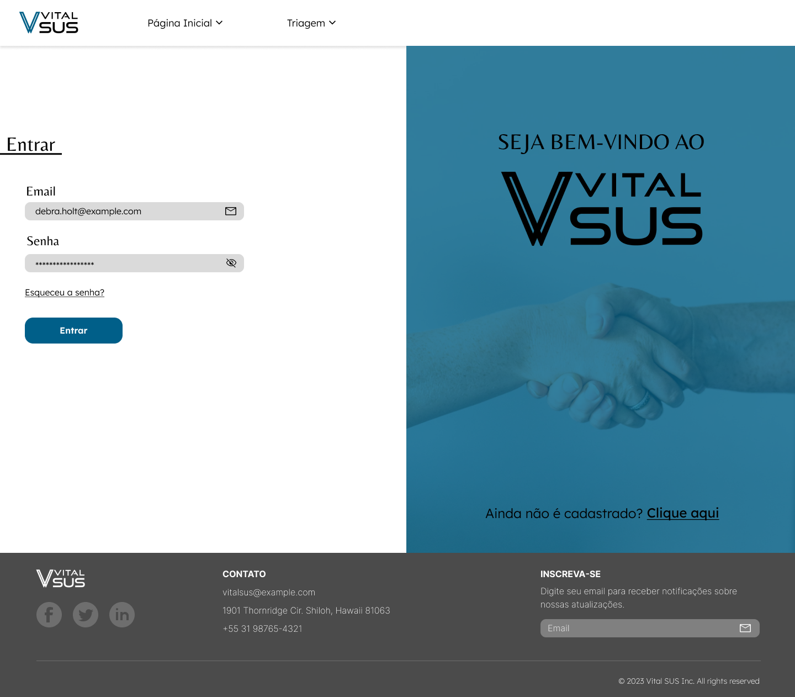
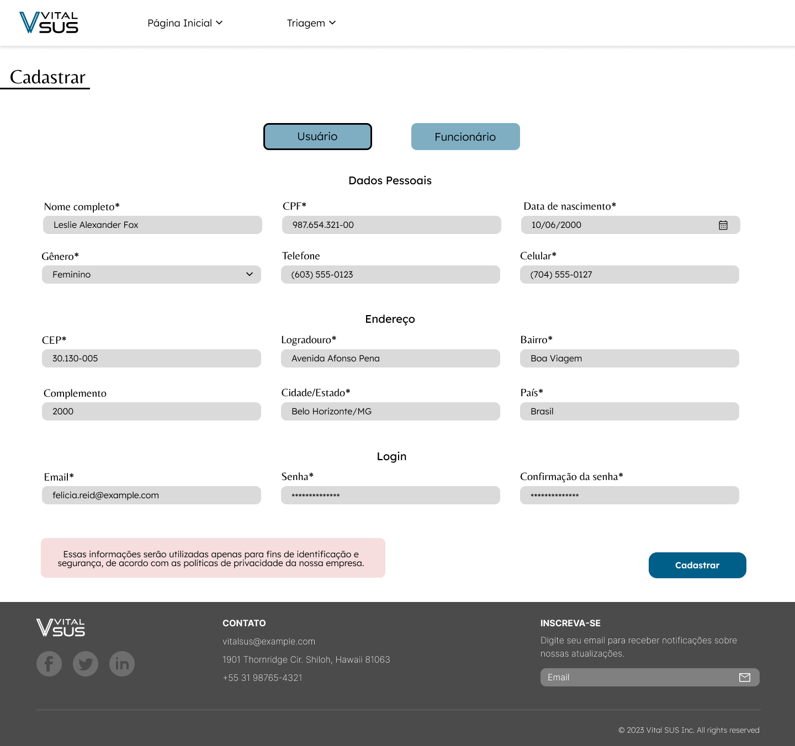
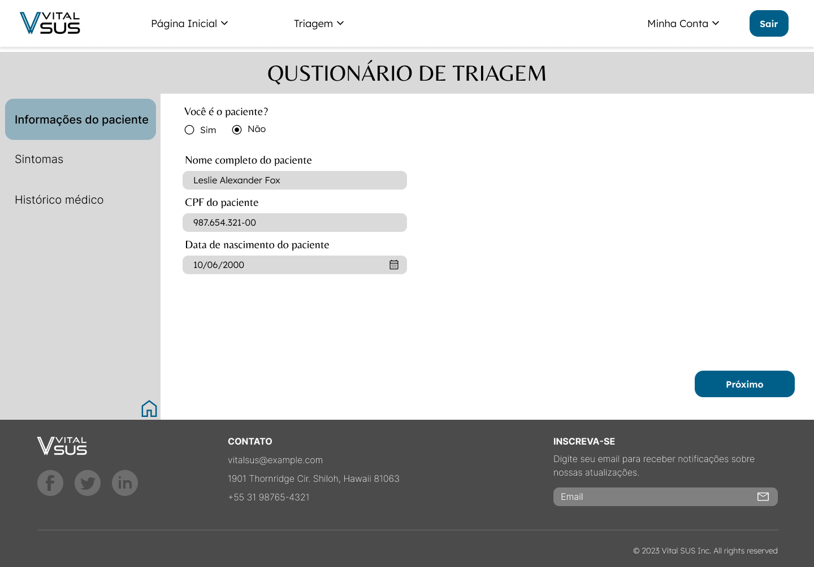
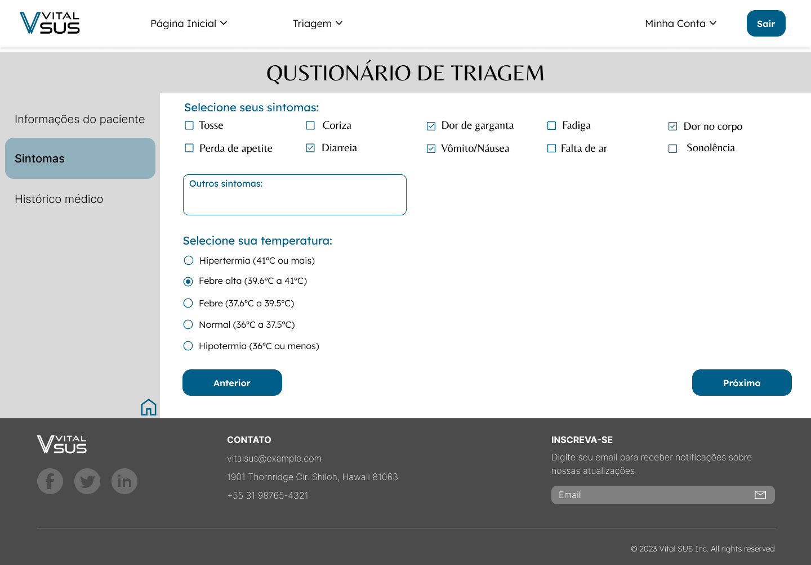
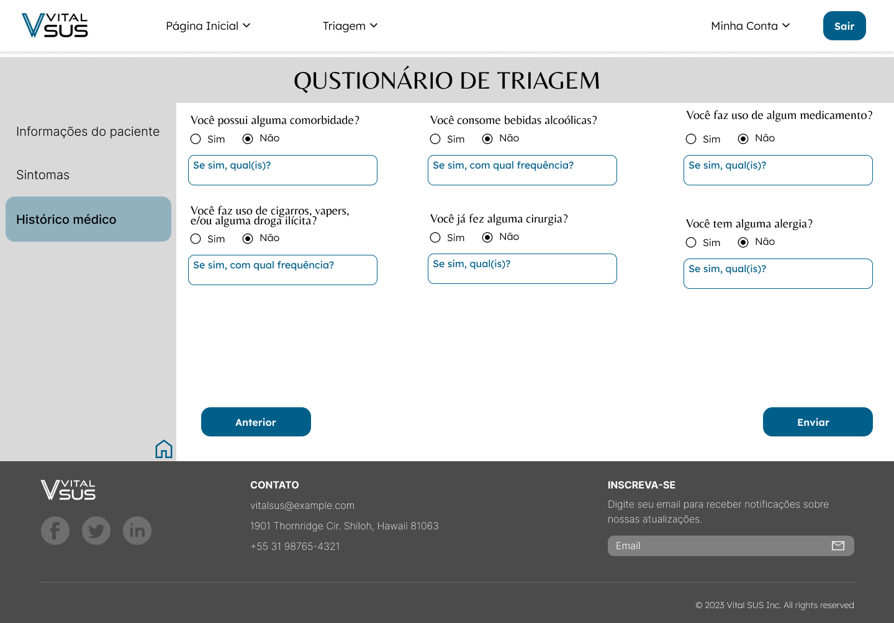

# Projeto de Interface

Ao desenvolver a interface do sistema, estamos levando em consideração diversas questões que são cruciais para garantir uma experiência de usuário satisfatória. Estamos nos concentrando em aspectos como agilidade, acessibilidade e usabilidade, para que o sistema possa ser utilizado com facilidade por pessoas de diferentes perfis e com diferentes necessidades.

Para garantir uma experiência visual coesa e padronizada em todas as telas, estamos adotando uma identidade visual consistente em todas as páginas do sistema, que inicialmente está disponível apenas para desktop.
## Fluxo do Usuário 

O fluxo de usuário (*User Flow*) é uma técnica fundamental no processo de desenvolvimento de sites e aplicativos, pois permite ao desenvolvedor mapear todo o fluxo de telas do sistema. Essa técnica tem como objetivo principal alinhar os caminhos e as possíveis ações que o usuário pode realizar ao longo da utilização do sistema, com a colaboração dos membros da equipe de desenvolvimento.

Ao utilizar a técnica de fluxo de usuário, é possível criar uma representação visual de todo o processo de utilização do sistema, permitindo que a equipe possa identificar pontos que precisam ser melhorados ou ajustados. Além disso, o mapeamento do fluxo de usuário também ajuda a garantir que a interface do sistema seja intuitiva e fácil de usar, o que contribui para uma melhor experiência do usuário.

Figura 2 - Fluxo do usuário.

Fonte: Dos autores (2023).

É importante destacar que cada uma das telas que compõem esse fluxo de interação é detalhada na seção de Wireframes que se segue. Essa seção fornece informações mais específicas sobre cada uma das telas e como elas se relacionam com as demais. Os wireframes são esboços das telas que representam a disposição dos elementos e funcionalidades da interface do usuário, bem como a hierarquia das informações apresentadas em cada tela.

## Wireframes

O texto apresentado descreve a estrutura comum das telas do sistema, conforme previamente apresentado no fluxo de telas. Essas telas são compostas por três grandes blocos distintos, que são o cabeçalho, o conteúdo e o rodapé, como exemplificado na Figura abaixo.

- O cabeçalho é a parte superior da página que geralmente contém o logo da empresa ou aplicação, bem como a navegação principal. Essa navegação pode incluir links para outras seções do site, área de login e cadastro, busca, entre outros. O cabeçalho é uma parte importante da página, pois permite que o usuário acesse facilmente outras áreas do site e saiba onde está navegando.

- O conteúdo é a área central da página e é onde são apresentados os principais elementos da tela, como formulários, tabelas, gráficos, imagens, texto, entre outros. Essa área é a principal parte da página e é onde a maior parte da interação do usuário com o sistema ocorre. É importante que o conteúdo seja apresentado de maneira clara e organizada para que o usuário possa facilmente compreender as informações apresentadas.

- O rodapé é a barra na parte inferior da página que contém informações adicionais sobre a empresa ou site, além de links úteis, como políticas de privacidade, termos de uso, contato, redes sociais, entre outros. O rodapé é uma área importante da página que geralmente contém informações legais ou outras informações que não precisam estar no corpo principal da página.

Portanto, a estrutura comum das telas do sistema é composta por esses três blocos distintos, que trabalham juntos para criar uma experiência do usuário eficiente e satisfatória. A compreensão desses blocos é essencial para o desenvolvimento de interfaces de usuário bem-sucedidas.

### Tela - Página Inicial

Para a página inicial existem duas opções de wireframes para a página inicial do sistema, uma com o usuário logado e outra com o usuário não logado:

**Wireframe com o usuário logado:**

- Cabeçalho com menu "Minha conta", opções de "Página Inicial", "Triagem" e botão de logout;

- Seção "Se sentindo mal?", com um breve texto explicativo sobre a importância da triagem e um botão que encaminha para a página de realização da triagem;

- Seção "Benefífios de uma triagem online", com motivos pelo qual o usuário deve optar por realizar a triagem online;

**Wireframe com o usuário não logado:**

- Mesma página porém o cabeçalho apresenta um botão de Entrar/Criar conta.
- O botão da seção "Se sentindo mal?" encaminha para a página de Entrar/Criar conta.

### Tela - Entrar

A tela de login é uma página do sistema que permite aos usuários já cadastrados acessar a área restrita, onde estão disponíveis diversas funcionalidades, como a realização de triagens hospitalares e o acompanhamento de seu histórico de saúde. O bloco de conteúdo da página é composto pelos campos de e-mail e senha, que o usuário deve preencher com as informações de sua conta previamente cadastrada, a fim de autenticar-se no sistema.

Caso o usuário não possua uma conta cadastrada, a página de login também disponibiliza um componente na barra lateral, que o direciona para a tela de cadastro, onde poderá preencher um formulário com seus dados pessoais e criar uma nova conta no sistema. Este componente pode ajudar a incentivar a criação de novas contas e aumentar o número de usuários ativos na plataforma.

### Tela - Cadastro 

A tela de cadastro é um componente fundamental do sistema, pois é através dela que novos usuários podem se inscrever para utilizar as funcionalidades oferecidas pela plataforma. Nesta tela, o usuário é solicitado a preencher um formulário com diversas informações pessoais, incluindo nome completo, CPF, data de nascimento, gênero, telefone, celular, CEP e endereço completo.

Além disso, o usuário também é solicitado a informar um endereço de e-mail válido e a criar uma senha segura para garantir a autenticação e segurança do seu acesso ao sistema posteriormente.

Após preencher corretamente todos os campos do formulário, o usuário pode clicar no botão de "cadastrar" e será redirecionado para a página inicial.

### Tela - Questionário da triagem

Para a tela de triagem existem três etapas para preencher o formulário, uma com as informações do paciente, uma com seus sintomas apresentados e outra com o seu histórico médico:

**Wireframe do formulário de informações do paciente:**

Nessa tela o usuário irá selecionar se a triagem é para ele mesmo ou para outra pessoa, se for para outra pessoa ele deve preencher as informações desse paciente.

**Wireframe do formulário de sintomas:**

Na segunda parte ele irá selecionar e/ou descrever seus sintomas e sua temperatura.

**Wireframe do formulário de histórico médico:**

E por último irá responder um questionário sobre seu histórico médico.

