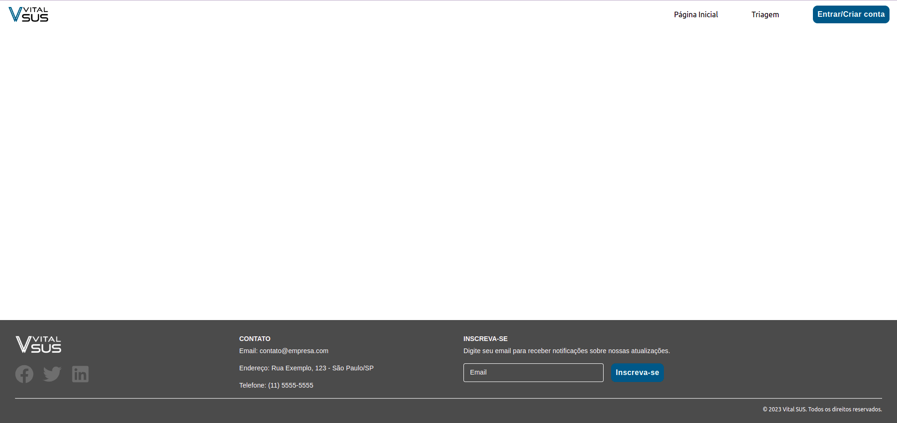

# Template padrão do site

Pré-requisitos: <a href="2-Especificação do Projeto.md"> Especificação do Projeto</a>, <a href="3-Projeto de Interface.md"> Projeto de Interface</a>, <a href="4-Metodologia.md"> Metodologia</a>

# TEMPLATE PADRÃO DO SITE

O layout padrão utilizado nas páginas do site é a base estrutural que define como a informação é organizada e apresentada ao usuário. O layout a ser utilizado tem correspondência com o projeto de interface, conforme ilustado na figura abaixo:

Figura 1 - Template padrão do site

