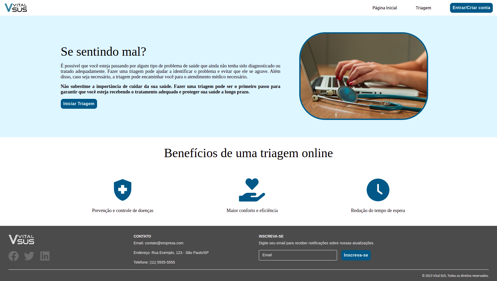
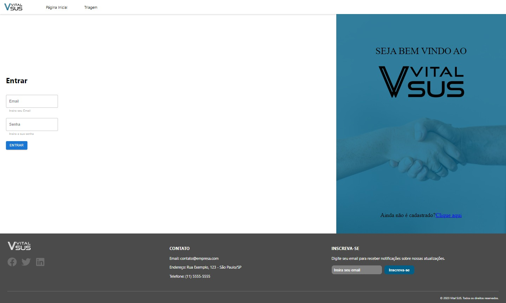
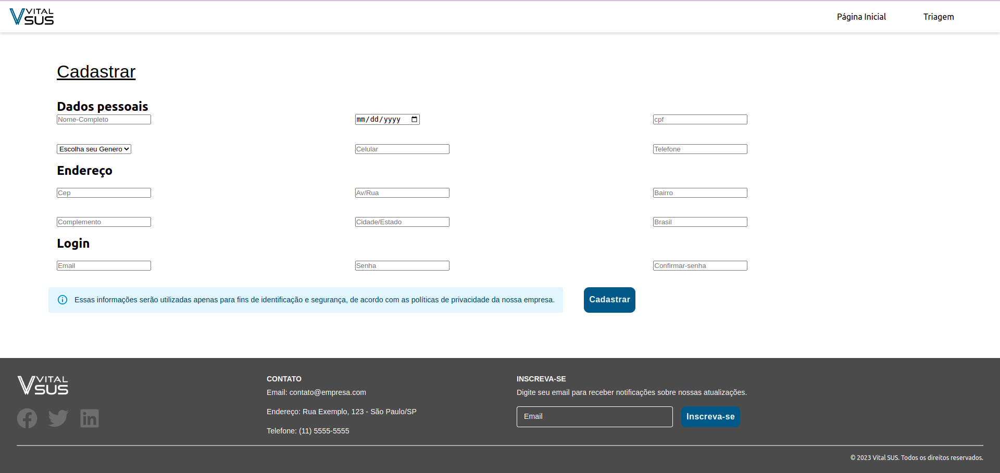

# Programação de Funcionalidades

O site e composto pelos seguintes layouts:

- **Cabeçalho (header) para navegação possibilitando acesso a:**
  - Página inicial.
  - Formulário para triagem.
  - Botão para entrar/cadastrar ou sair.
- **Rodapé (footer) possuindo informações de:**
  - Contato
  - Links para redes sociais
  - Cadastro de email para notificações

## Tela Principal

A tela principal informa aos usuários os objetivos da aplicação, inclui informações importantes sobre o processo de triagem, como instruções para os usuários e benefícios da utilização da aplicação no processo de triagem. Possui links para acesso as demais páginas de login e cadastro no sistema.

Figura 2 - Tela Principal

# FUNCIONALIDADE DO SISTEMA (TELAS)

As funcionalidades do sistema são as ações que os usuários podem realizar dentro da plataforma. Essas funcionalidades são apresentadas através das telas do sistema, que são as interfaces gráficas que permitem aos usuários interagir com o software de forma visual e intuitiva. Cada tela apresenta um conjunto de funcionalidades específicas, que podem incluir desde a visualização de informações até a realização de ações complexas, como cadastro de dados, busca e edição de informações, emissão de relatórios, entre outras. As telas devem ser projetadas de forma clara e organizada, de modo a facilitar a navegação do usuário e garantir que todas as funcionalidades do sistema sejam acessíveis de forma rápida e simples. Além disso, é importante que as telas sejam responsivas e adaptáveis a diferentes tamanhos de tela, para garantir uma boa experiência de uso em dispositivos móveis e desktops.

## Tela Login (RF-001)

Tela permite ao usuário cadastrado acesso ao sistema Vital SUS. Na tela e possível identificar os campos de **Email** e **Senha** para acesso do usuário cadastrado, possui o logo com o nome da aplicação e link para cadastro caso o usuário não possua.

Figura 2 - Tela Login

## Tela cadastro (RF-003)

Na tela de cadastro, os usuários podem inserir suas informações pessoais para permitir a sua identificação e criar uma conta de acesso ao sistema Vital SUS e A página inclui campos para preenchimento de dados:

- **Informações necessárias para identificação dos pacientes:**
  - Nome completo
  - Data de nascimento
  - CPF
  - Gênero
  - Telefone de contato
  - Endereço completo
- **Campos para cadastro de acesso:**
  - Email
  - Senha

Figura 2 - Tela Cadastro

