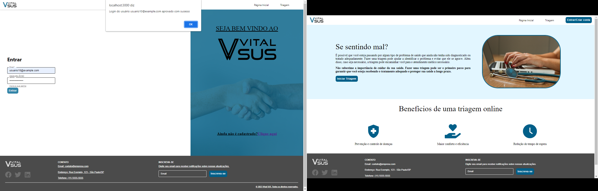
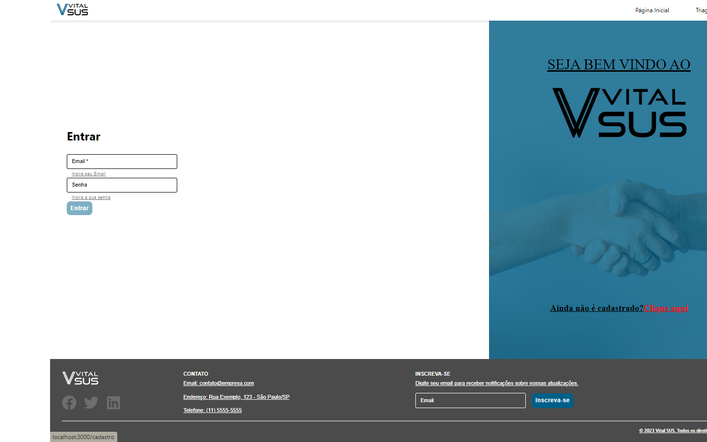

Pré-requisitos: <a href="2-Especificação do Projeto.md"> Especificação do Projeto</a>, <a href="3-Projeto de Interface.md"> Projeto de Interface</a>

Apresente os cenários de testes utilizados na realização dos testes da sua aplicação. Escolha cenários de testes que demonstrem os requisitos sendo satisfeitos.

Enumere quais cenários de testes foram selecionados para teste. Neste tópico o grupo deve detalhar quais funcionalidades avaliadas, o grupo de usuários que foi escolhido para participar do teste e as ferramentas utilizadas.

# Plano de Testes de Software

Os testes de software realizados utilizaram o modelo "caixa preta". O modelo "caixa preta" é uma abordagem de teste que se concentra na funcionalidade externa do software, sem considerar sua estrutura interna ou o conhecimento do código-fonte. Nesse tipo de teste, o software é avaliado com base em sua entrada e saída, sem ter acesso ao funcionamento interno do programa.

## Funcionalidade Tela Login

| **Caso de teste 1**   | **RF-001 Realizar acesso ao sistema através da tela Login**                                        |
| --------------------- | -------------------------------------------------------------------------------------------------- |
| Requisitos associados | RF-O01 Site deve apresentar uma página onde o usuário faça o login com as credenciais cadastradas. |
| Objetivo do teste     | Verificar a autenticação do usuário cadastrado                                                     |
| Passos                | 1. Acessar a pagina de Login                                                                       |
|                       | 2. Informar o Email cadastrado                                                                     |
|                       | 3. Informar a senha cadastrada                                                                     |
|                       | 4. Confirmar clicando no botão Entrar                                                              |
| Critério de êxito     | - O usuário deve ser redirecionado a página "homePage" da aplicação                                |

Figura 1 - êxito funcionalidade

## Funcionalidade Tela Login

| **Caso de teste 1**   | **RF-001 Redirecionar usuário não cadastrado para tela de cadastro**                                |
| --------------------- | --------------------------------------------------------------------------------------------------- |
| Requisitos associados | RF-O01 A página Login deve apresentar um "link" para redirecionar o usuário para página de cadastro |
| Passos                | 1. Acessar a pagina de Login                                                                        |
|                       | 2. Clicar no Link "Clique aqui"                                                                     |
|                       |                                                                                                     |
|                       |                                                                                                     |
| Critério de êxito     | - O usuário deve ser redirecionado a página "cadastro" da aplicação                                 |

Figura 2 - êxito funcionalidade

## Ferramentas de Testes (Opcional)

Comente sobre as ferramentas de testes utilizadas.

> **Links Úteis**:
>
> - [IBM - Criação e Geração de Planos de Teste](https://www.ibm.com/developerworks/br/local/rational/criacao_geracao_planos_testes_software/index.html)
> - [Práticas e Técnicas de Testes Ágeis](http://assiste.serpro.gov.br/serproagil/Apresenta/slides.pdf)
> - [Teste de Software: Conceitos e tipos de testes](https://blog.onedaytesting.com.br/teste-de-software/)
> - [Criação e Geração de Planos de Teste de Software](https://www.ibm.com/developerworks/br/local/rational/criacao_geracao_planos_testes_software/index.html)
> - [Ferramentas de Test para Java Script](https://geekflare.com/javascript-unit-testing/)
> - [UX Tools](https://uxdesign.cc/ux-user-research-and-user-testing-tools-2d339d379dc7)
