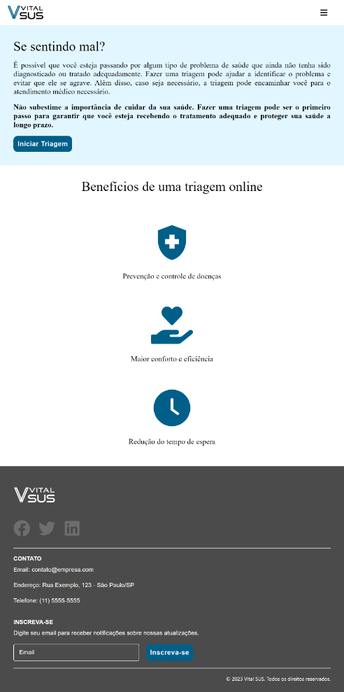
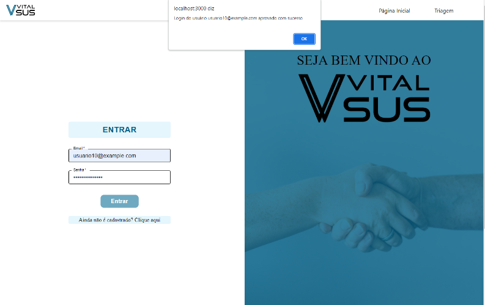

# Registro de Testes de Software

Pré-requisitos: <a href="3-Projeto de Interface.md"> Projeto de Interface</a>, <a href="8-Plano de Testes de Software.md"> Plano de Testes de Software</a>

Relatório com as evidências dos testes de software realizados no sistema pela equipe, baseado em um plano de testes pré-definido.

# Registro de testes de software

### Evidência: CT-01 - Vizualizar página inicial

** Critérios de êxito **

- Deve ser exibido a página inicial com duas sessões: "Se sentindo mal?" e "Benefícios de uma triagem online"
- Deve estar responsivo para desktop, tablet e mobile a página o header e o footer.

Figura 1 - Visualização da tela inicial

Figura 2 - Responsividade da tela inicial

---

### Evidência: CT-02 - Realizar acesso ao sistema através da tela

** Critérios de êxito **

- O botão só ficará habilitado caso o email e senha atenda os critérios dos campos
- Ao clicar em "Entrar", deverá exibir um alert com login de sucesso e redirecionar para a página inicial

Figura 3 - Função, desabilitar botão "Entrar"

Figura 4 - Alerta de login realizado com sucesso

---

### Evidência: CT-03 - Redirecionar usuário não cadastrado para tela de cadastro

** Critérios de êxito **

- O usuário deve ser redirecionado a página cadastro da aplicação

Figura 5 - Redirecionamento página de cadastro

---

### Evidência: CT-04 - Cadastrar novos usuários

** Critérios de êxito **

- Ao clicar em "Cadastrar", deverá exibir um alert com cadastro de sucesso e redirecionar para a página inicial.
- Fazer download de um arquivo json com todas as informações de cadastro.

Figura 6 - Alerta "usuário cadastrado com sucesso"

Figura 7 - Download arquivo JSON

---

### Evidência: CT-05 - Preencher formulário de triagem com sintomas do paciente

** Critérios de êxito **

- Ao final do último passo deve ser apresentando uma mensagem "Triagem realizada com sucesso!"
- O usuário deve ser redirecionado para a página inicial

Figura 8 - Alerta "Triagem realizada com sucesso!"

---

## Avaliação

Discorra sobre os resultados do teste. Ressaltando pontos fortes e fracos identificados na solução. Comente como o grupo pretende atacar esses pontos nas próximas iterações. Apresente as falhas detectadas e as melhorias geradas a partir dos resultados obtidos nos testes.

> **Links Úteis**:
>
> - [Ferramentas de Test para Java Script](https://geekflare.com/javascript-unit-testing/)
