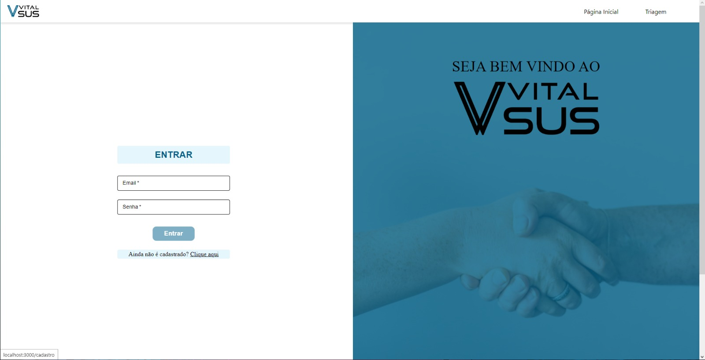
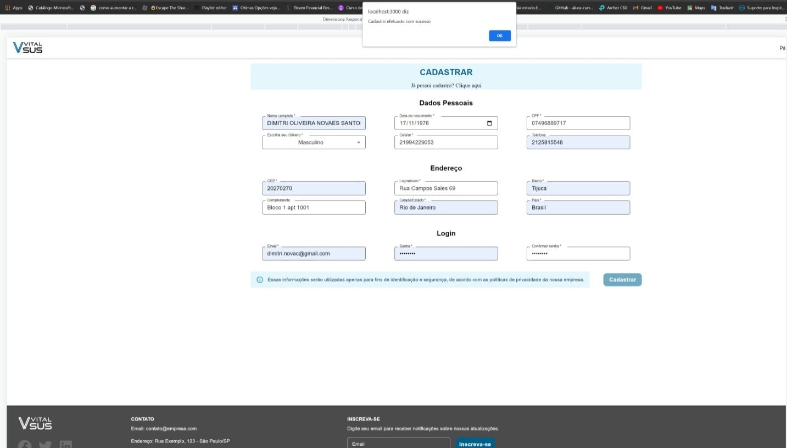
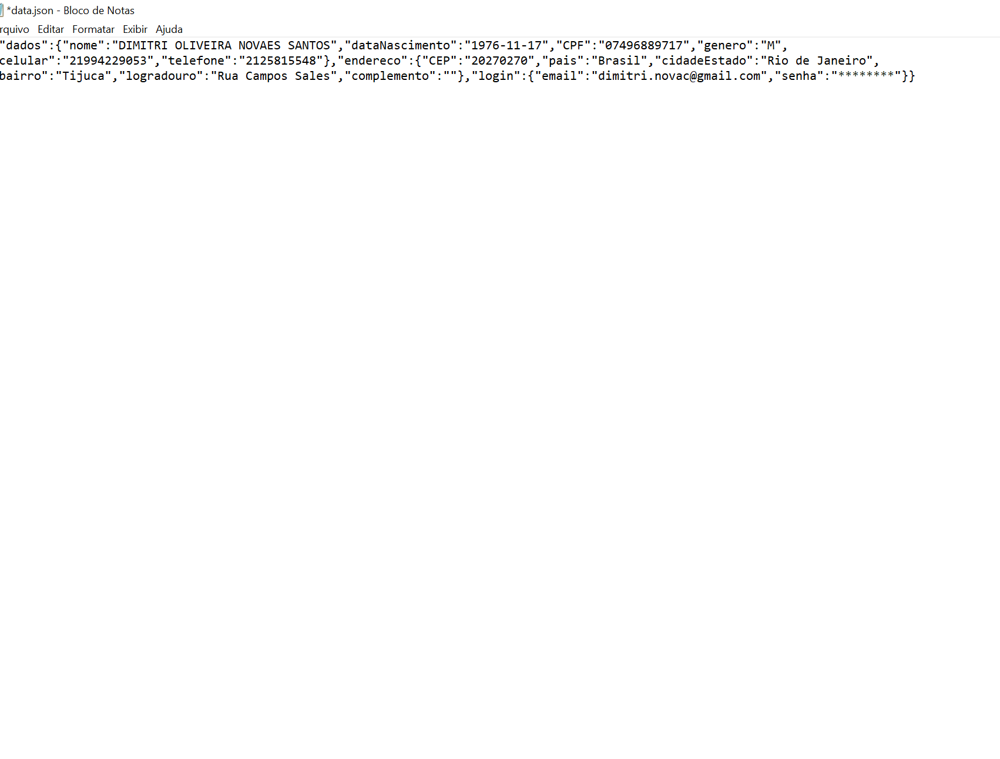
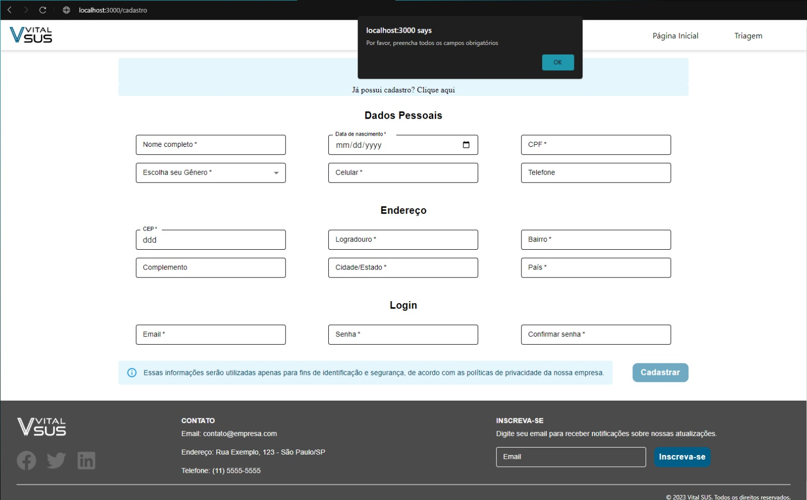
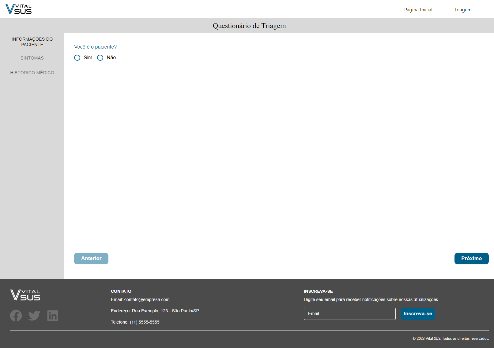
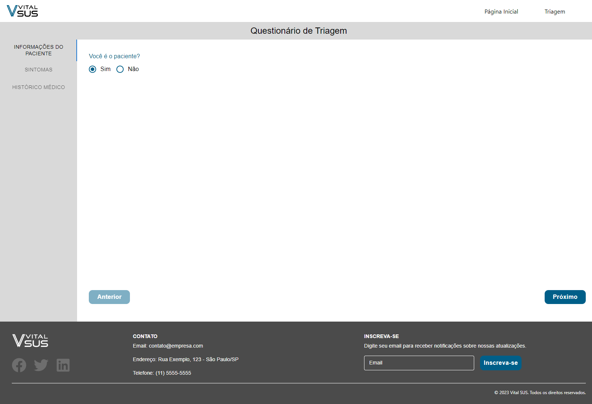
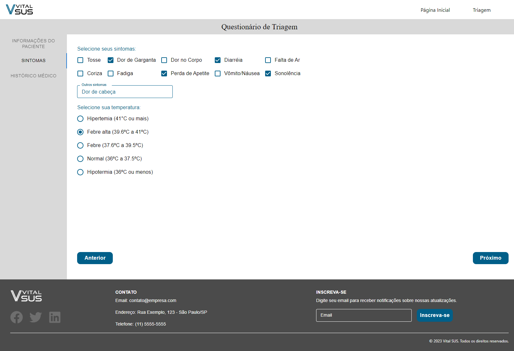
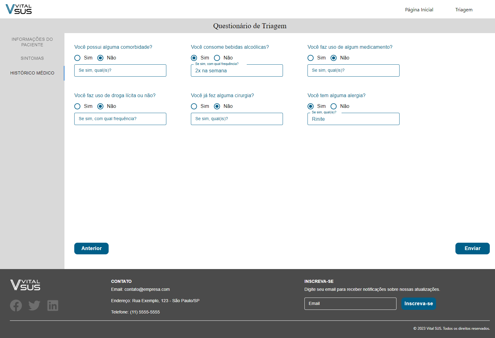
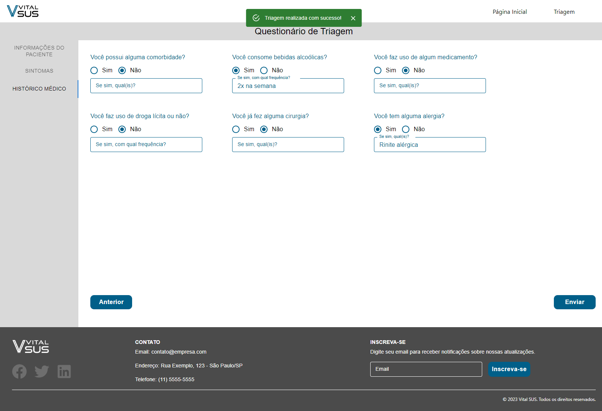

# Registro de Testes de Software

### Evidência: CT-01 - Vizualizar página inicial

** Critérios de êxito **

- Deve ser exibido a página inicial com duas sessões: "Se sentindo mal?" e "Benefícios de uma triagem online"
- Deve estar responsivo para desktop, tablet e mobile a página o header e o footer.

Figura 1 - Visualização da tela inicial

Figura 2 - Responsividade da tela inicial

---

### Evidência: CT-02 - Realizar acesso ao sistema através da tela

** Critérios de êxito **

- O botão só ficará habilitado caso o email e senha atenda os critérios dos campos
- Ao clicar em "Entrar", deverá exibir um alert com login de sucesso e redirecionar para a página inicial

Figura 4 - Alerta de login realizado com sucesso

---

### Evidência: CT-03 - Redirecionar usuário não cadastrado para tela de cadastro

** Critérios de êxito **

- O usuário deve ser redirecionado a página cadastro da aplicação

Figura 5 - Redirecionamento página de cadastro

---

### Evidência: CT-04 - Cadastrar novos usuários

** Critérios de êxito **

- Ao clicar em "Cadastrar", deverá exibir um alert com cadastro de sucesso e redirecionar para a página inicial.
- Fazer download de um arquivo json com todas as informações de cadastro.

Figura 6 - Alerta "usuário cadastrado com sucesso"

Figura 7 - Download arquivo JSON

Figura 8 - Validação dos campos da tela cadastro

---

### Evidência: CT-05 - Preencher formulário de triagem com sintomas do paciente

** Critérios de êxito **

- Ao clicar em "próximo", irá para aba seguinte.
- Ao clicar em "anterior" retornará aba de "informações do paciente" e se perderá as informações preenchidas mas que não foram salvas.
- Ao clicar em "anterior" retornará para a aba de "sintomas" e se perderá as informações preenchidas mas que não foram salvas.

---
